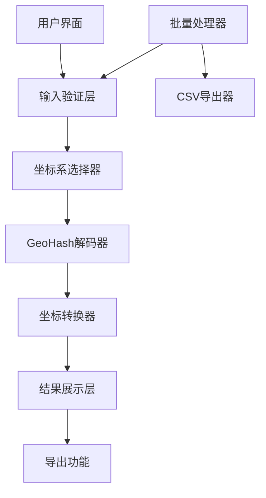

# 设计文档

## 概述

GeoHash坐标转换工具是一个基于Next.js的Web应用，专门用于将百度09坐标系和GPS84坐标系下的geohash编码转换为经纬度坐标。应用采用现代化的前端架构，支持单个和批量转换，并可部署到Vercel平台。

## 架构

### 技术栈
- **前端框架**: Next.js 14 (App Router)
- **UI库**: Tailwind CSS + shadcn/ui组件
- **坐标转换库**: 自定义geohash解码算法 + coordtransform库（用于坐标系转换）
- **部署平台**: Vercel
- **语言**: TypeScript

### 架构模式
采用客户端渲染(CSR)模式，所有转换计算在浏览器端完成，无需后端API。



## 组件和接口

### 核心组件

#### 1. 主页面组件 (HomePage)
- 负责整体布局和状态管理
- 集成所有子组件
- 处理全局错误状态

#### 2. 输入组件 (InputSection)
```typescript
interface InputSectionProps {
  value: string;
  onChange: (value: string) => void;
  coordinateSystem: 'BD09' | 'GPS84';
  onCoordinateSystemChange: (system: 'BD09' | 'GPS84') => void;
  isBatchMode: boolean;
  onBatchModeChange: (isBatch: boolean) => void;
}
```

#### 3. 转换器组件 (ConverterEngine)
```typescript
interface ConversionResult {
  input: string;
  success: boolean;
  longitude?: number;
  latitude?: number;
  error?: string;
}

interface ConverterEngineProps {
  inputs: string[];
  coordinateSystem: 'BD09' | 'GPS84';
  onConvert: (results: ConversionResult[]) => void;
}
```

#### 4. 结果展示组件 (ResultsDisplay)
```typescript
interface ResultsDisplayProps {
  results: ConversionResult[];
  onCopy: (result: ConversionResult) => void;
  onExport: () => void;
}
```

### 核心算法接口

#### GeoHash解码器
```typescript
interface GeoHashDecoder {
  decode(geohash: string): { latitude: number; longitude: number } | null;
  validate(geohash: string): boolean;
}
```

#### 坐标转换器
```typescript
interface CoordinateConverter {
  bd09ToWgs84(lng: number, lat: number): [number, number];
  wgs84ToBd09(lng: number, lat: number): [number, number];
}
```

## 数据模型

### 输入数据模型
```typescript
interface InputData {
  geohashList: string[];
  coordinateSystem: 'BD09' | 'GPS84';
  isBatchMode: boolean;
}
```

### 转换结果模型
```typescript
interface ConversionResult {
  input: string;           // 原始geohash输入
  success: boolean;        // 转换是否成功
  longitude?: number;      // 经度（成功时）
  latitude?: number;       // 纬度（成功时）
  error?: string;         // 错误信息（失败时）
  coordinateSystem: 'BD09' | 'GPS84'; // 原始坐标系
}
```

### 导出数据模型
```typescript
interface ExportData {
  results: ConversionResult[];
  timestamp: string;
  totalCount: number;
  successCount: number;
  errorCount: number;
}
```

## 错误处理

### 错误类型定义
```typescript
enum ErrorType {
  INVALID_GEOHASH = 'INVALID_GEOHASH',
  DECODE_FAILED = 'DECODE_FAILED',
  COORDINATE_OUT_OF_RANGE = 'COORDINATE_OUT_OF_RANGE',
  BATCH_SIZE_EXCEEDED = 'BATCH_SIZE_EXCEEDED',
  UNKNOWN_ERROR = 'UNKNOWN_ERROR'
}

interface ConversionError {
  type: ErrorType;
  message: string;
  input: string;
  suggestions?: string[];
}
```

### 错误处理策略
1. **输入验证错误**: 实时显示格式提示和示例
2. **解码错误**: 提供可能的原因和修正建议
3. **批量处理错误**: 继续处理有效输入，标记无效项
4. **系统错误**: 显示友好的通用错误信息

## 测试策略

### 单元测试
- **GeoHash解码算法测试**: 验证各种长度和格式的geohash解码准确性
- **坐标转换测试**: 验证BD09和GPS84坐标系转换的精度
- **输入验证测试**: 测试各种边界情况和无效输入
- **批量处理测试**: 验证大量数据处理的性能和准确性

### 集成测试
- **端到端转换流程测试**: 从输入到结果展示的完整流程
- **UI交互测试**: 验证用户界面的响应性和可用性
- **导出功能测试**: 验证CSV导出的格式和内容正确性

### 性能测试
- **批量处理性能**: 测试1000+geohash同时转换的性能
- **内存使用测试**: 确保大批量处理不会导致内存泄漏
- **渲染性能测试**: 验证大量结果展示时的UI响应性

### 部署测试
- **Vercel部署测试**: 验证在Vercel环境下的正常运行
- **跨浏览器兼容性测试**: 确保在主流浏览器中正常工作
- **移动端适配测试**: 验证响应式设计在移动设备上的表现

## 实现细节

### GeoHash解码算法
使用标准的Base32解码算法，支持1-12位长度的geohash字符串。解码过程包括：
1. Base32字符验证和转换
2. 二进制位交替提取经纬度
3. 区间递归细分计算最终坐标

### 坐标系转换
- **BD09转GPS84**: 使用标准的坐标转换公式，包括椭球参数校正
- **精度保持**: 保留小数点后6位精度，满足大多数应用需求
- **边界检查**: 验证转换后坐标是否在合理范围内

### 批量处理优化
- **分块处理**: 将大批量数据分成小块处理，避免UI阻塞
- **Web Worker**: 考虑使用Web Worker进行后台计算
- **进度显示**: 为大批量处理提供进度指示器

### 用户体验优化
- **实时验证**: 输入时实时验证geohash格式
- **智能提示**: 提供常见错误的修正建议
- **快速复制**: 一键复制单个或批量结果
- **响应式设计**: 适配桌面和移动设备